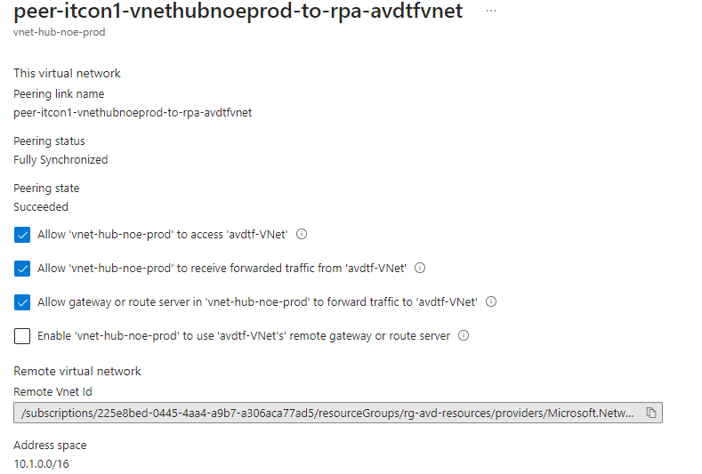
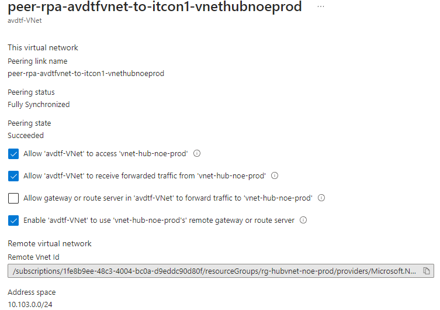

# Use of create session host and network config

The code builds Session Hosts and deploy them to an AVD Host Pool with Terraform. 
[link](https://learn.microsoft.com/en-us/azure/developer/terraform/create-avd-session-host)
[link1](https://learn.microsoft.com/en-us/azure/developer/terraform/configure-avd-network-settings)

